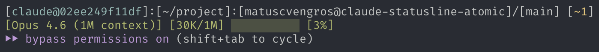

# Atomic Statusline for Claude Code

[](https://github.com/matuscvengros/claude-statusline-atomic/actions/workflows/ci.yml)
[](https://www.npmjs.com/package/claude-statusline-atomic)
[](https://www.npmjs.com/package/claude-statusline-atomic)
[](https://github.com/matuscvengros/claude-statusline-atomic/blob/main/LICENSE)

Just the basics. Everything else is noise.

No dependencies. No config files. No build step. One command and you're done.



## Install

```sh
npx claude-statusline-atomic@latest install
```

That's it. Restart Claude Code. You're welcome.

## What you get

A two-line status bar that actually tells you something useful:

```
[user@hostname]:[~/my/project]:[owner@repo-name]/[main] [+3 ~2]
[Opus 4.6] [100K/1M] █░░░░░░░░░ [10%]
```

**Line 1** — who you are, where you are, what branch, what's changed. Repo name is a clickable link (Cmd/Ctrl+click).

**Line 2** — which model, how many tokens burned, and a progress bar that changes color as you fill up:

| Color  | Usage   | Vibe          |
|--------|---------|---------------|
| 🟢 Green  | 0–50%   | Plenty of room |
| 🟡 Yellow | 50–75%  | Getting there  |
| 🟠 Orange | 75–90%  | Wrap it up     |
| 🔴 Red    | 90–100% | Living on the edge |

## Why this one

There are other statusline packages out there. Most of them do too much. This one:

- **Zero dependencies** — just Node.js, nothing to install, nothing to break
- **Fast** — runs in under 100ms, you won't notice it's there
- **Cross-platform** — tested on Linux, macOS, and Windows (Node 18, 20, 22)
- **Clean uninstall** — removes only its own config, never touches yours

## How it works

Claude Code's [status line](https://code.claude.com/docs/en/statusline) runs a shell command after each assistant message, piping JSON session data to stdin. The command's stdout becomes the status bar.

This tool provides that command. A single Node.js script reads the JSON, crunches the numbers, and spits out two lines of color-coded info. No daemon, no background process, no magic.

The installer copies the script to `~/.claude/statusline.js` and adds a `statusLine` entry to `~/.claude/settings.json` with a `# claude-statusline-atomic` marker — so uninstall knows what's ours and leaves everything else alone.

## Uninstall

Changed your mind? No hard feelings.

```sh
npx claude-statusline-atomic@latest uninstall
```

## Requirements

- Node.js >= 18
- [Claude Code](https://docs.anthropic.com/en/docs/claude-code)

## License

[MIT](LICENSE)
